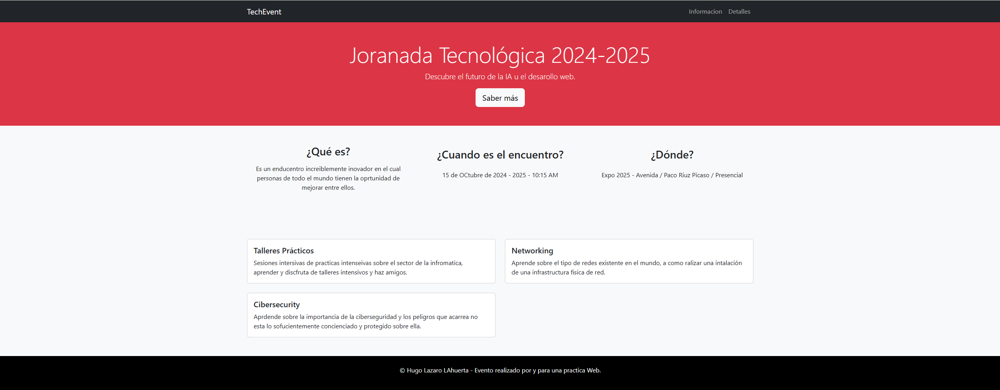

# Proyecto: Jornada Tecnológica 2024-2025

## Descripción del Proyecto
Este proyecto consiste en una web informativa para una **Jornada Tecnológica** local. El objetivo es presentar el evento de forma atractiva, detallando qué es, cuándo y dónde se celebra.

## Estructura y Diseño (Bootstrap 5)
La web ha sido diseñada siguiendo una estructura responsive para poder adaptarse a móviles, tablets y ordenadores:
* **Navbar**: Barra de navegación superior para acceso mucho más rápido.
* **Hero**: Sección de impacto con el título principal del evento.
* **Sección de Información (Grid)**: Uso de sistema de 3 columnas (`col-md-4`) para los datos principales.
* **Sección de Detalles (Grid)**: Uso de sistema de 2 columnas (`col-md-6`) para información extendida.
* **Componentes**: Se han implementado **Cards** de Bootstrap para organizar los talleres y ponencias.
* **Footer**: Pie de página con información de contacto y créditos.

## Historial de Versiones (GitHub)
Siguiendo los requisitos de la práctica, se trabajó en una rama secundaria llamada `desarrollo` con los siguientes commits:
1. **Paso 1**: Estructura base navbar y header.
2. **Paso 2**: Implementación de secciones Grid y componentes Card para contenido.
3. **Paso 3**: Finalización de diseño, Footer y organización de la carpeta de capturas.

## Dificultad Técnica
Una de las mayores dificultades técnicas que tuve fue gestionar el historial de Git para asegurar que los commits fueran correctamente progresivos y significativos según el enunciado. Se solucionó mediante el uso de comandos avanzados de gestión de ramas y organización lógica de las subidas.
